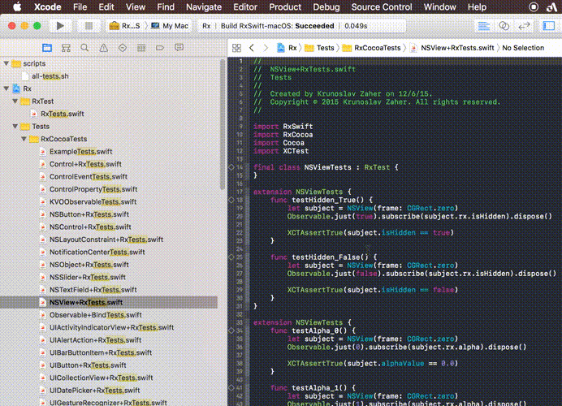
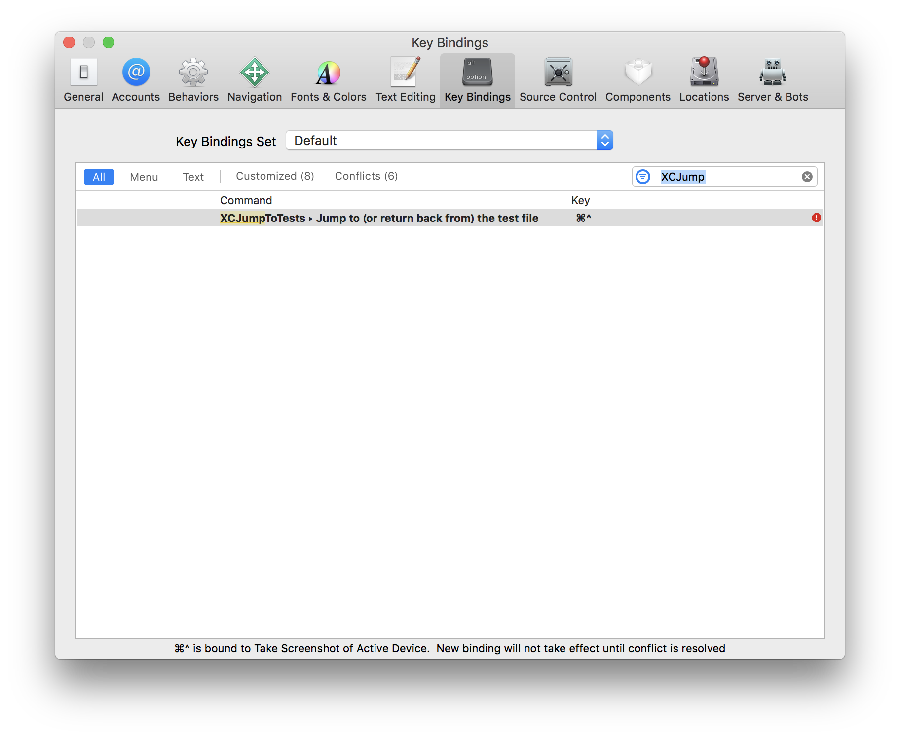
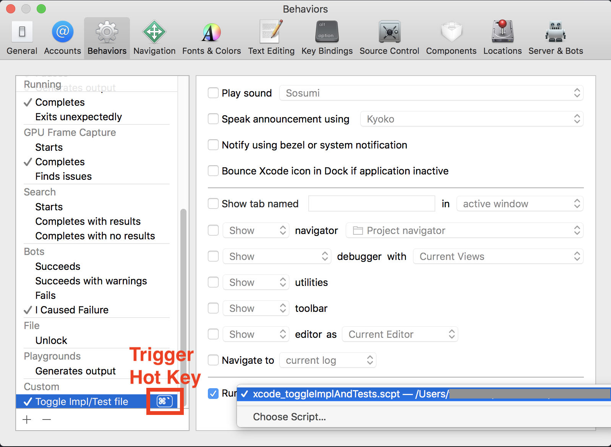

# XCJumptToTests

The tool toggles `XXX.swift` and `XXXTests.swift or XXXSpec.swift` with one stroke.

## Xcode Source Editor Extension version

### usage

1. clone and open the project.
2. `Product > Archive` with your own signing.
3. execute the `.app` then the Xcode Source Editor Extension will be installed to your computer.
4. give the extension a hot key as you like.

### restriction

Since the Xcode Source Extension requires to be `Archive` d, you should be a Apple Developer Program member.
If you don't pay Apple, never mind, you can use AppleScript ver.

## AppleScript version

### usage

1. place `xcode_toggleImplAndTests.scpt` anywhare you like.
2. bind to Xcode with `Custom Behaviors` feature.

## Author

[takasek](https://twitter.com/takasek)

## License

XCJumpToTests is available under the MIT license. See the LICENSE file for more info.

